# arcadia-pycolor
Tools for using the Arcadia palette in Python.  
This package automatically generate color palettes and color maps for use with Matplotlib.

---

## 0. Setup
You can install this package directly from GitHub using pip.
First, make sure you're using the right `pip` for your desired environment.  
`which pip`

Install using the pip in that environment.  
`pip install git+https://github.com/Arcadia-Science/arcadia-pycolor.git#egg=arcadia_pycolor`

Alternatively, if you're installing a development version, use the name of the Github branch.  
`pip install git+https://github.com/Arcadia-Science/arcadia-pycolor.git@branch/name#egg=arcadia_pycolor`

### Import

Import the package as usual.  
You might want to abbreviate it to `apc` as below. 


```python
import arcadia_pycolor as apc
```

---
## 1. Basic Color Access

Each named color is stored as a `dict`, accessible as its own variable.  
This enables quick lookup of a color of interest.

You can also generate a visual display of a color using the `print_color()` method.


```python
apc.aegean
```


    {'arcadia:aegean': '#5088C5'}


```python
apc.print_color(apc.aegean)
```


<span style="font-family: monospace"> #5088C5 <span style="color: #5088C5">██████</span> arcadia:aegean</span>


### Palette Dictionaries

The base color palettes (`Core`, `Neutral`, `Accent`, etc.) are also stored as dictionaries.


```python
apc.Accent
```


    {'arcadia:aegean': '#5088C5',
     'arcadia:amber': '#F28360',
     'arcadia:seaweed': '#3B9886',
     'arcadia:canary': '#F7B846',
     'arcadia:aster': '#7A77AB',
     'arcadia:rose': '#F898AE'}


```python
apc.print_color(apc.Accent)
```


<span style="font-family: monospace"> #5088C5 <span style="color: #5088C5">██████</span> arcadia:aegean</span><br><span style="font-family: monospace"> #F28360 <span style="color: #F28360">██████</span> arcadia:amber</span><br><span style="font-family: monospace"> #3B9886 <span style="color: #3B9886">██████</span> arcadia:seaweed</span><br><span style="font-family: monospace"> #F7B846 <span style="color: #F7B846">██████</span> arcadia:canary</span><br><span style="font-family: monospace"> #7A77AB <span style="color: #7A77AB">██████</span> arcadia:aster</span><br><span style="font-family: monospace"> #F898AE <span style="color: #F898AE">██████</span> arcadia:rose</span>


---
## 2. The `Palette` class

In addition to basic dictionaries that store colors, `arcadia_pycolor` includes some custom Python classes that make it easier to use different palettes in different contexts.  
Each of the core color palettes is stored as a `Palette` object, which has a variety of methods that allow you visualize the included colors.  

For example, the `.display()` method prints the color palette as an image.


```python
apc.Palettes['arcadia:Core'].display()
apc.Palettes['arcadia:Neutral'].display()
apc.Palettes['arcadia:AccentFull'].display()
apc.Palettes['arcadia:LightFull'].display()
```


    

    


    

    


    

    


    

    


You can find a list of all the `Palette` objects in the `apc.Palettes` `dict`.


```python
apc.Palettes.keys()
```


    dict_keys(['arcadia:All', 'arcadia:Core', 'arcadia:Neutral', 'arcadia:Accent', 'arcadia:AccentExpanded', 'arcadia:AccentFull', 'arcadia:AccentOrdered', 'arcadia:Light', 'arcadia:LightExpanded', 'arcadia:LightFull', 'arcadia:LightOrdered', 'arcadia:AccentAll', 'arcadia:AccentAllOrdered', 'arcadia:Other', 'arcadia:AllOrdered'])


### Data structures

Different plotting software might expect color information in different formats, including `list`s, `dict`s, `tuple`s, etc.  
The `Palette` class allows for quick access to a variety of data structures.  


```python
# Return palette colors as a dictionary
apc.Palettes['arcadia:Accent'].dict
```


    {'arcadia:aegean': '#5088C5',
     'arcadia:amber': '#F28360',
     'arcadia:seaweed': '#3B9886',
     'arcadia:canary': '#F7B846',
     'arcadia:aster': '#7A77AB',
     'arcadia:rose': '#F898AE'}


```python
# Return colors as a list
apc.Palettes['arcadia:Accent'].list
```


    ['#5088C5', '#F28360', '#3B9886', '#F7B846', '#7A77AB', '#F898AE']


```python
# Return palette colors as a list of tuples
apc.Palettes['arcadia:Accent'].tuple_list
```


    [('arcadia:aegean', '#5088C5'),
     ('arcadia:amber', '#F28360'),
     ('arcadia:seaweed', '#3B9886'),
     ('arcadia:canary', '#F7B846'),
     ('arcadia:aster', '#7A77AB'),
     ('arcadia:rose', '#F898AE')]


---
## 3. The `Gradient` class

In addition to individual colors, sometimes it's important to have gradients of color for plotting.  
Each Arcadia color is available as a linear gradient from `arcadia:paper` (#FAFAFA).  
You can access these in the `apc.Gradients` dictionary by appending an `s` to the end of the color name.

These gradients are stored in the `Gradient` class, which is a subclass of `Palette`.  
All methods from the `Palette` class also work on `Gradient`s, such as `.display()`.


```python
apc.Gradients['arcadia:aegeans'].display()
```


    

    


The package includes some custom color gradients that are designed to be analogous to existing color gradients like "viridis" or "magma" but are more aesthetically compatible with Arcadia's brand colors.  


```python
apc.Gradients['arcadia:viridis'].display()
apc.Gradients['arcadia:magma'].display()
apc.Gradients['arcadia:cividis'].display()
```


    

    


    

    


    

    


These gradients are composed of a dictionary of colors, just like a `Palette` class, but with an additional set of `values` from 0 to 1 for each color in the gradient.  
These `values` indicate where each color falls along the gradient.  

You can access colors and values in different data structure, just as you would for the `Palette` class.


```python
# Return gradient colors as a dictionary
apc.Gradients['arcadia:viridis'].dict
```


    {'arcadia:concord': '#341E60',
     'arcadia:grape': '#5A4596',
     'arcadia:aegean': '#5088C5',
     'arcadia:lime': '#97CD78',
     'yellow': '#FFFF00'}


```python
# Return values of gradient colors
apc.Gradients['arcadia:viridis'].values
```


    [0, 0.23, 0.49, 0.77, 1]


```python
# Return paired list of gradient colors and positions as tuples
apc.Gradients['arcadia:viridis'].grad_tuple_list
```


    [(0, '#341E60'),
     (0.23, '#5A4596'),
     (0.49, '#5088C5'),
     (0.77, '#97CD78'),
     (1, '#FFFF00')]


```python
# Return paired list of gradient colors and positions as lists
apc.Gradients['arcadia:viridis'].grad_nested_list
```


    [[0, '#341E60'],
     [0.23, '#5A4596'],
     [0.49, '#5088C5'],
     [0.77, '#97CD78'],
     [1, '#FFFF00']]


### Gradient visualization

You can also use built-in methods of the `Gradient` class to see the gradient in grayscale and see how uniformly its lightness scales.


```python
apc.Gradients['arcadia:viridis'].plot_gradient()
apc.Gradients['arcadia:viridis'].plot_lightness()
```


    

    


    
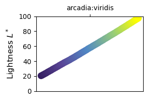
    


### Strong linear gradients

In addition to gradients from Arcadia's colors to `arcadia:paper`, there are also built-in linear color gradients that have greater contrast between low and high values.


```python
linear_gradients = ['arcadia:' + color for color in ['reds', 'oranges', 'yellows', 'greens', 'teals', 'blues', 'purples', 'magentas']]

figure = apc.display_palette([{'name': grad, 'length': 9, 'cmap': apc.Gradients[grad].mpl_LinearSegmentedColormap} for grad in linear_gradients], figsize = (6, 6))
```


    
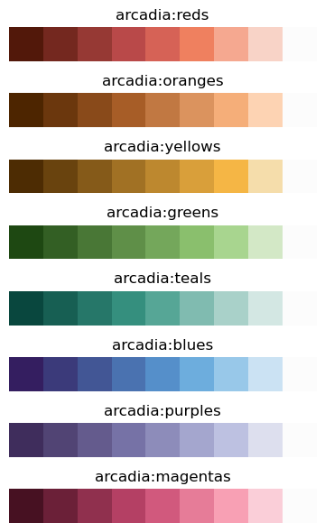
    


### Bicolor gradients

In addition to linear gradients, the package also contains several built-in bicolor gradients.  
These color gradients have been chosen to have linearly-increasing lightness and to be colorblind-friendly.  


```python
bicolor_gradients = ['arcadia:aegeanamber', 'arcadia:astercanary', 'arcadia:limerose', 'arcadia:seaweedtangerine', 'arcadia:poppies', 'arcadia:pansies', 'arcadia:dahlias', 'arcadia:lilies']

figure = apc.display_palette([{'name': grad, 'length': 9, 'cmap': apc.Gradients[grad].mpl_LinearSegmentedColormap} for grad in bicolor_gradients], figsize = (6, 6))
```


    

    


## Reverse gradients

All gradients in the package are also available in a reversed order.  
These can be accessed from the `apc.Gradients` dictionary by adding `'_r'` to the end of the gradient name.  


```python
apc.Gradients['arcadia:aegeans'].display()
apc.Gradients['arcadia:aegeans_r'].display()
```


    

    


    

    


---
## 5. `matplotlib` features

The `arcadia_pycolor` package can integrate with `matplotlib`.  
It registers Arcadia colors, palettes, and gradients as `matplotlib` named colors when using the `apc.mpl_setup()` function.


```python
# run this function to register Arcadia's colors with matplotlib
# by default, this adds all colors, palettes, and gradients, as well as updates the style sheet.
# you can choose to modify these things individually; use help(apc.mpl_setup) to learn more.
apc.mpl_setup()
```

Once colors have been registered with `matplotlib`, they're availble to be used in all your plotting needs.


```python
import matplotlib.pyplot as plt
import numpy as np

colors = ['arcadia:seaweed', 'arcadia:amber']

plt.figure(figsize = (3, 2))

for color in colors:
    x, y = np.arange(5), np.random.rand(5)
    plt.plot(x, y, color = color, label = color)

plt.ylabel('time')
plt.xlabel('expression')

plt.legend(loc = 'upper right', bbox_to_anchor = (1.8, 1))
plt.show()
```


    
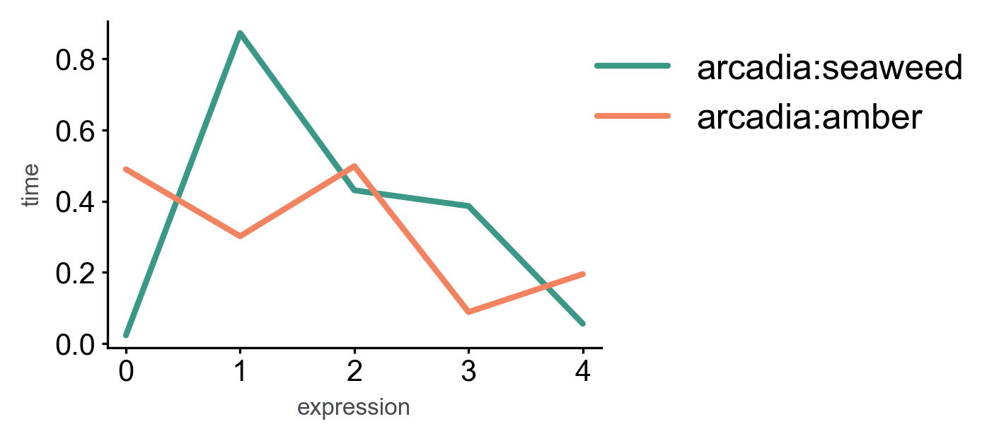
    


All `Palette` and `Gradient` colors are registered as `matplotlib` named entries.


```python
prng = np.random.RandomState(20230710)
random_sample_1 = prng.random_sample(size = (5, 5))

cmaps = ['arcadia:aegeans', 'arcadia:viridis', 'arcadia:poppies_r']

fig, axs = plt.subplots(1, len(cmaps), figsize = (2.5 * len(cmaps), 1.8))

for cmap, ax in zip(cmaps, axs):
    im = ax.imshow(random_sample_1, cmap = cmap)
    plt.colorbar(im, label = cmap)

plt.tight_layout()
plt.show()
```


    
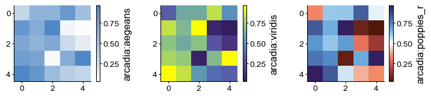
    


### Default plotting style

Running `apc.mpl_setup()` updates the Matplotlib stylesheet settings so that the defaults better conform with Arcadia's figure styles.  
You can use Arcadia's default style without having to manually set it for every plot.  

Things that are modified by using `arcadia_pycolor` with `matplotlib`:
- the default color cycler is changed to match `arcadia:AccentAllOrdered`
- the default gradient is set to `arcadia:viridis`
- the default font is changed to `Arial`
- plots saved as `.svg` or `.pdf` format automatically have editable instead of rasterized text


```python
from scipy.interpolate import make_interp_spline

nlines = 5
timepoints = 4

X_ = []
Y_ = []

prng = np.random.RandomState(20230710)
random_sample = prng.random_sample(size = (20, 20))

for i in np.arange(nlines):
    x = np.arange(timepoints)
    y = np.random.rand(timepoints)

    spline = make_interp_spline(x, y)

    X_.append(np.linspace(x.min(), x.max(), 500))
    Y_.append(spline(X_)[0])
    

xs = []
ys = []
points = 50
for i in np.arange(timepoints):
    xi, yi = prng.normal(loc = x[i], scale = np.random.rand(), size = (2, points))
    xs.append(xi)
    ys.append(yi)

def plot_style_examples(title = ''):
    fig, axs = plt.subplots(1, 4, figsize = (11, 3))
    
    for i in np.arange(nlines):
        axs[0].plot(X_[i], Y_[i])
    axs[0].set_xlabel('timepoint')
    axs[0].set_ylabel('expression')
    
    axs[1].bar([1, 2, 3, 4], [1, 2, 3, 4])
    axs[1].set_xlabel('category')
    axs[1].set_ylabel('value')
    
    im = axs[2].imshow(random_sample)
    axs[2].set_xlabel('x')
    axs[2].set_ylabel('y')
    
    for i in np.arange(timepoints):
        axs[3].scatter(xs[i], ys[i], label = i)
    axs[3].legend(loc = 'best', bbox_to_anchor = (1, 1), title = 'category')
    
    plt.suptitle(title)
    plt.colorbar(im)
    
    plt.tight_layout()

    plt.show()

# Plot examples using Matplotlib's default styling
with plt.style.context("default"):
    plot_style_examples("Plot using Matplotlib's default style")

# Plot examples using Arcadia's basic style (set as default by importing arcadia_pycolor)
plot_style_examples("Plot using Arcadia's basic style")
```


    
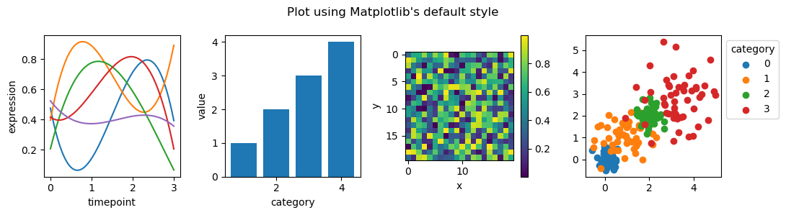
    


    
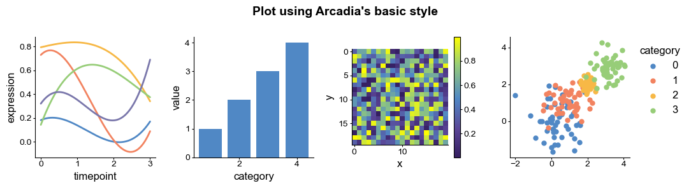
    


---
## 6. Customization

The classes and methods of the package can be used to build and test your own color palettes and gradients.  


```python
# construct a gradient using built-in colors and custom values
my_gradient_dict = {
    'color_dict': apc.royal | apc.aegean | apc.vitalblue | apc.bluesky | apc.zephyr,
    'values': [0, 0.3, 0.5, 0.8, 1]
}

# instantiate a new Gradient object
my_gradient = apc.Gradient(
    name = 'my_gradient',
    color_dict = my_gradient_dict['color_dict'], 
    values = my_gradient_dict['values']
)

# use built-in methods to plot the gradient
my_gradient.display()
my_gradient.plot_gradient()
my_gradient.plot_lightness()

# register the gradient with Matplotlib
my_gradient.mpl_LinearSegmentedColormap_register()

# use custom colormap by name in Matplotlib
plt.figure(figsize = (3, 2.5))
im = plt.imshow(random_sample_1, cmap = 'my_gradient')
plt.colorbar(im, label = 'my_gradient')
plt.show()
```


    

    


    

    


    

    


    
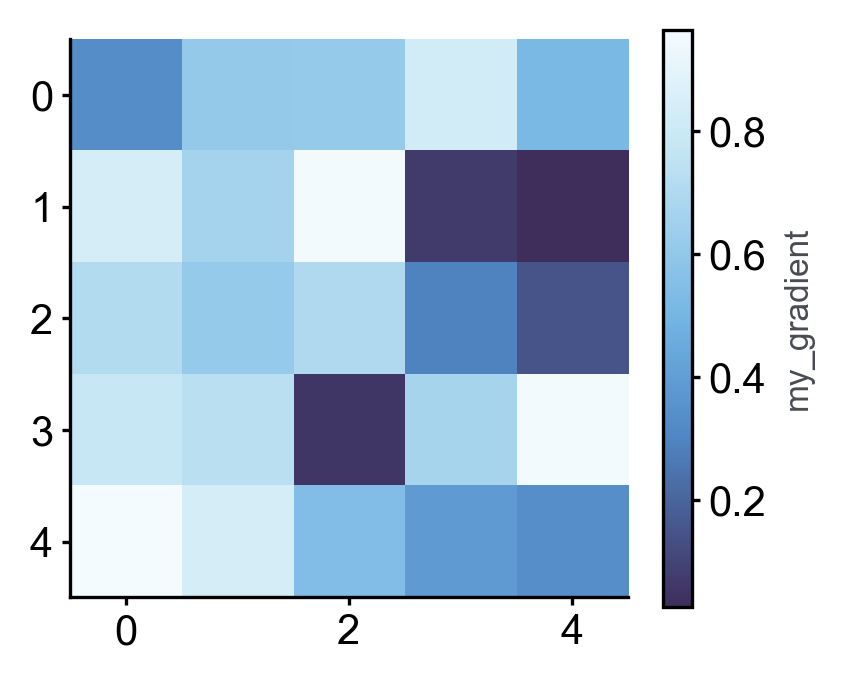
    


---
## 7. Color vision deficiency (CVD) testing

`Palette` and `Gradient` objects have methods for testing how colors would appear for various color vision deficiencies.  

`arcadia_pycolor` leverages the [color vision simulation provided by `colorspacious`](https://colorspacious.readthedocs.io/en/latest/tutorial.html#simulating-colorblindness).  
You can display a color palette using `Palette.display_cvd()` for these color vision deficiencies:
- `'d'` for deuteranopia
- `'p'` for protanopia
- `'t'` for tritanopia


```python
test_palette = 'arcadia:AccentOrdered'

apc.Palettes[test_palette].display()

cvd_forms = ['d', 'p', 't']
for form in cvd_forms:
    apc.Palettes[test_palette].display_cvd(form)
```


    
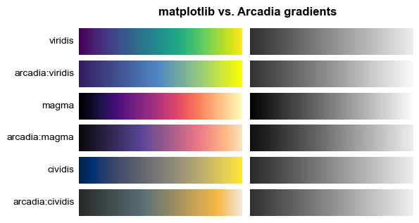
    


    

    


    

    


    

    


You can access these cvd-transformed colors using these functions:  
- `Palette.colors_cvd(form)` returns a list of the HEX colors of the palette that simulate that CVD
- `Palette.mpl_ListedColormap(form)` returns a matplotlib ListedColormap with colors that simulate that CVD
- `Gradient.mpl_LinearSegmentedColormap(form)` returns a matplotlib LinearSegmentedColormap with colors that simulate that CVD  

Several display methods also have a `_cvd` suffixed form:
- `Palette.display_cvd(form)`
- `Gradient.plot_gradient_cvd(form)`
- `Gradient.plot_lightness_cvd(form)`


```python
test_palette = 'arcadia:viridis'

apc.Gradients[test_palette].plot_gradient()

cvd_forms = ['d', 'p', 't']
for form in cvd_forms:
    apc.Gradients[test_palette].plot_gradient_cvd(form)
```


    

    


    
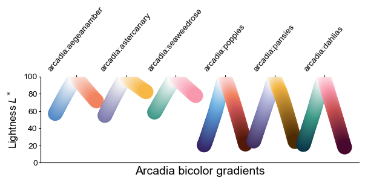
    


    

    


    

    


If you prefer to display the CVD differences as a single plot, you can try the following code.


```python
test_palette = 'arcadia:magma'

cvd_dict = {test_palette + '_' + form: apc.Gradients[test_palette].mpl_LinearSegmentedColormap_cvd(form) for form in cvd_forms}
plot_dict = {test_palette: apc.Gradients[test_palette].mpl_LinearSegmentedColormap} | cvd_dict

apc.plot_color_gradients(
    plot_dict,
    title = test_palette + ' CVD test',
    figsize = (6, 3)
)

apc.plot_color_lightness(
    plot_dict,
    title = test_palette + ' CVD test',
    figsize = (6, 3)
)
```


    
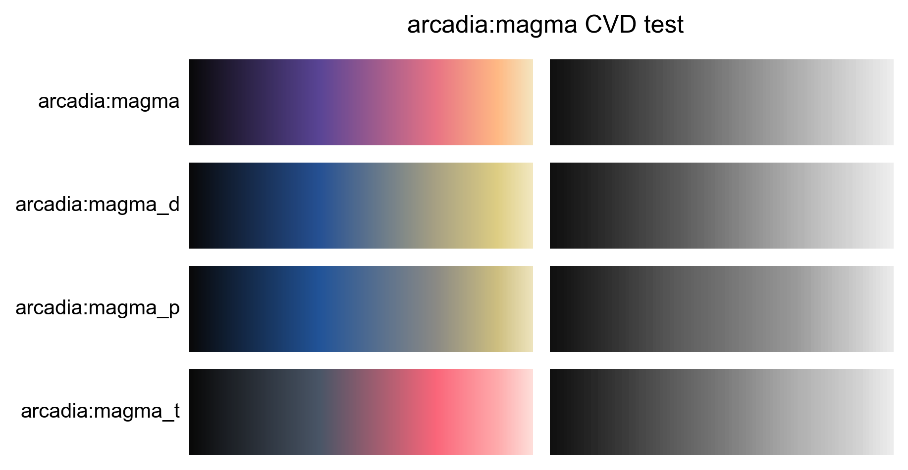
    


    
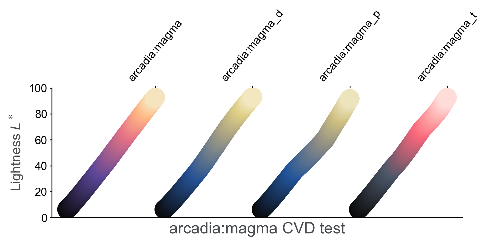
    


### `matplotlib` color vision deficiency integration

The color vision deficient versions of each gradient or palette are registered to matplotlib automatically when calling `apc.mpl_setup()` or when registering a `Palette` or `Gradient` object with `mpl_ListedColormap_register()` or `mpl_LinearSegmentedColormap_register()` respectively.  

You can access these as named colormaps by adding a `'_d'`, `'_p'`, or `'_t'` suffix to the end of the colormap name.


```python
prng = np.random.RandomState(20230710)
random_sample_1 = prng.random_sample(size = (5, 5))

cmaps = ['arcadia:aegeans', 'arcadia:aegeans_t', 'arcadia:viridis', 'arcadia:viridis_p']

fig, axs = plt.subplots(1, len(cmaps), figsize = (2.5 * len(cmaps), 1.8))

for cmap, ax in zip(cmaps, axs):
    im = ax.imshow(random_sample_1, cmap = cmap)
    plt.colorbar(im, label = cmap)

plt.tight_layout()
plt.show()
```


    
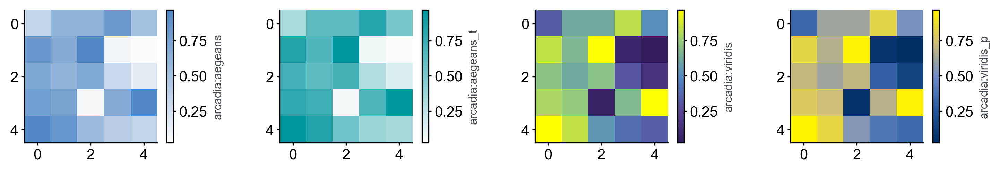
    


### Color vision deficiency simulation for existing images

Sometimes you've already generated a figure and you'd like to know if it's colorblind-friendly.  
You can generate colorblind images using `apc.simulate_cvd_image()`.  

This function should work on PNG, JPEG, and TIFF format images.


```python
image = 'README_files/cell_drawing.png'

print("----------\nOriginal image")

plt.figure(figsize = (3, 3))
plt.imshow(plt.imread(image))
plt.axis("off")
plt.tight_layout()
plt.show()

print("----------\nCVD simulations")

apc.simulate_cvd_image(image, fig_width = 6)
```

    ----------
    Original image


    

    


    ----------
    CVD simulations


    
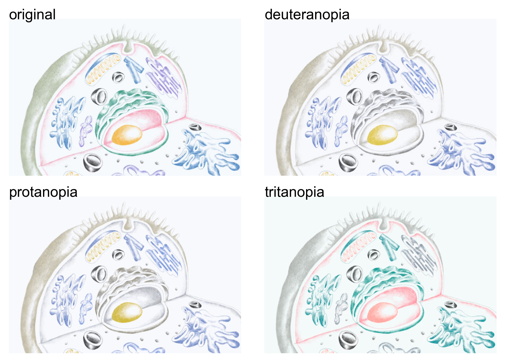
    


---
## 8. Index

The index below serves as a visual reference for the palettes and gradients.


```python
# basic palettes
basic_palettes = ['arcadia:Core', 'arcadia:Neutral', 
                  'arcadia:Accent', 'arcadia:Light', 
                  'arcadia:AccentExpanded', 'arcadia:LightExpanded', 
                  'arcadia:AccentFull', 'arcadia:LightFull', 'arcadia:AccentAll']

print("----------\nBasic Palettes")
for pal in basic_palettes:
    apc.Palettes[pal].display()

# palettes ordered to maximize color distance between each additional color
ordered_palettes = ['arcadia:AccentOrdered', 'arcadia:LightOrdered', 'arcadia:AccentAllOrdered']

print("----------\nOrdered Palettes")
for pal in ordered_palettes:
    apc.Palettes[pal].display()
```

    ----------
    Basic Palettes


    
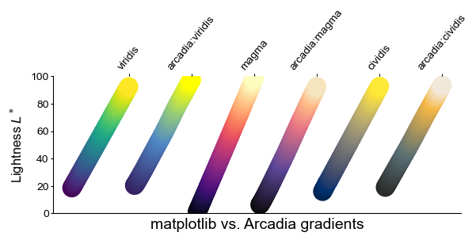
    


    

    


    
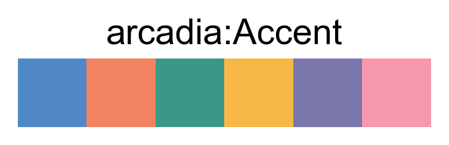
    


    
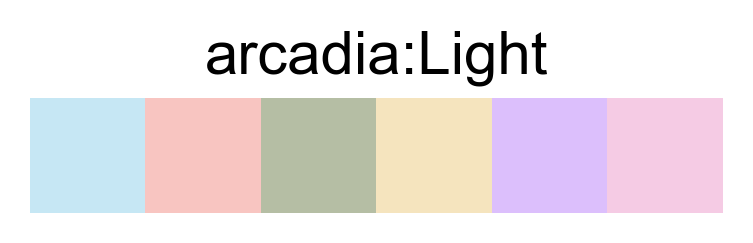
    


    
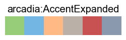
    


    
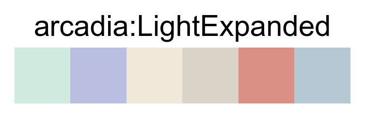
    


    

    


    

    


    

    


    ----------
    Ordered Palettes


    

    


    

    


    

    


### Comparing Matplotlib vs. Arcadia gradients

The gradients built into this package were chosen to resemble existing matplotlib [perceptually uniform colormaps](https://matplotlib.org/stable/gallery/color/colormap_reference.html).  
The colors used in the Arcadia colormaps are visually similar to matplotlib's maps, but strive to use Arcadia's color palette and compatible colors.

The plots below show the new colormaps compared to the original matplolotlib colormaps in grayscale.  
They also illustrate the linearly-increasing lightness of these colormaps, which approximates the matplotlib references.


```python
comparison_gradients = ['viridis', 'arcadia:viridis', 'magma', 'arcadia:magma', 'cividis', 'arcadia:cividis']

apc.plot_color_gradients(
    {grad: grad for grad in comparison_gradients},
    title = 'matplotlib vs. Arcadia gradients',
    figsize = (6, 3)
)

apc.plot_color_lightness(
    {grad: grad for grad in comparison_gradients},
    title = 'matplotlib vs. Arcadia gradients',
    figsize = (6, 3)
)
```


    
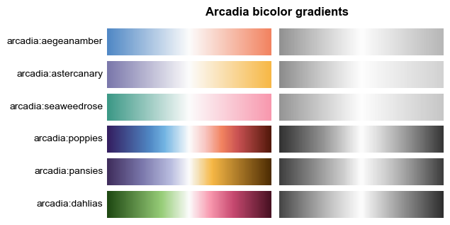
    


    
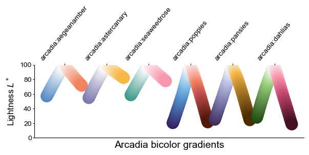
    


### Arcadia bicolor gradients

The bicolor gradients in the package were designed to be linearly decreasing in brightness in both directions.  
We've tried to make them colorblind-friendly as well.  

In general, the blue-red and purple-yellow colorschemes are more universally visible than the green-pink colorscheme.


```python
bicolor_gradients = [
    'arcadia:aegeanamber', 'arcadia:astercanary', 'arcadia:limerose', 'arcadia:seaweedtangerine',
    'arcadia:poppies', 'arcadia:pansies', 'arcadia:dahlias', 'arcadia:lilies'
]

apc.plot_color_gradients(
    {grad: grad for grad in bicolor_gradients},
    title = 'Arcadia bicolor gradients',
    figsize = (6, 4)
)

apc.plot_color_lightness(
    {grad: grad for grad in bicolor_gradients},
    title = 'Arcadia bicolor gradients',
    figsize = (7, 3),
    horizontal_spacing = 1.2,
    cmap_type = 'bicolor'
)
```


    
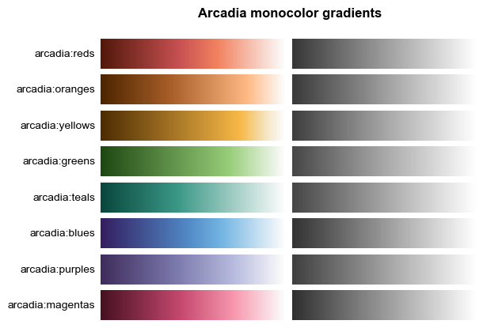
    


    
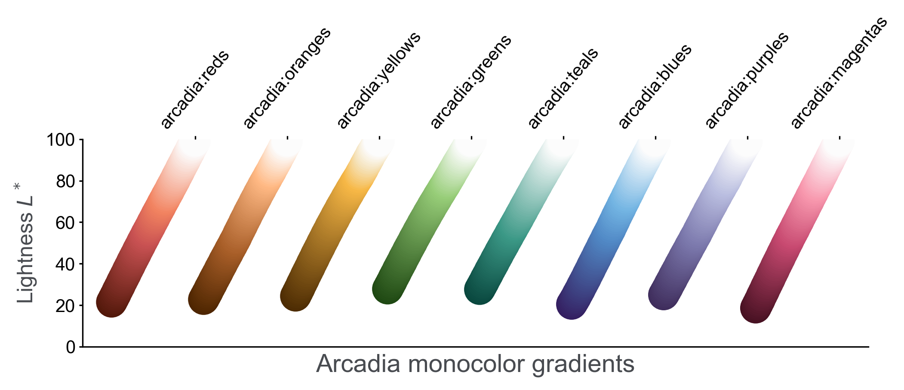
    


---
### Note
This README file is converted to markdown using:

`jupyter nbconvert --execute --to markdown README.ipynb`
