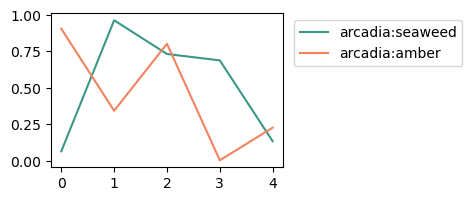
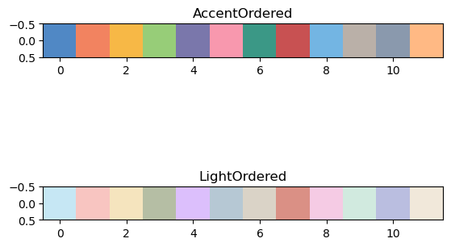
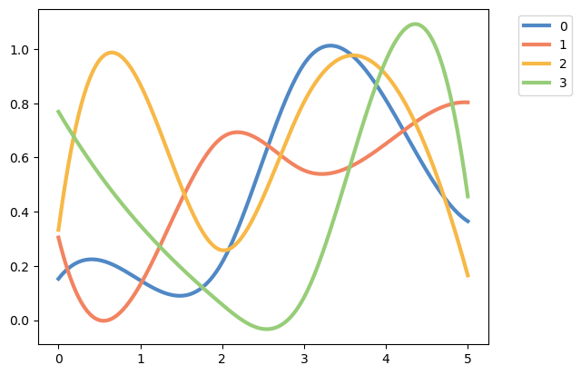
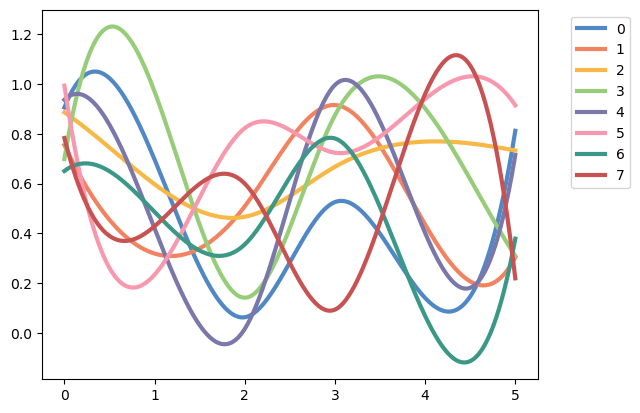
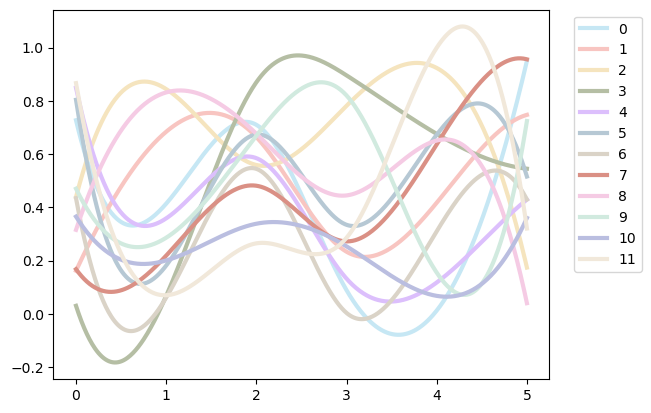
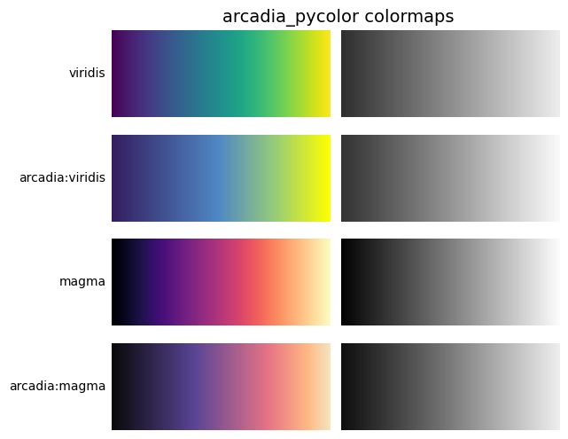
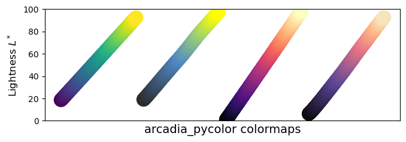

# arcadia-pycolor
Tools for using the Arcadia palette in Python.  
This package automatically generate color palettes and color maps for use with Matplotlib.

# Installation
You can install this package directly from GitHub using pip.
First, make sure you're using the right `pip` for your desired environment.  
`which pip`

Install using the pip in that environment.  
`pip install git+https://github.com/Arcadia-Science/arcadia-pycolor.git#egg=arcadia_pycolor`

## Import

Import the colors as follows.  
You can access the `'color':'HEX'` dictionaries from the below options:
- `arcadia_Core`: Core colors such as `'arcadia:forest'`
- `arcadia_Neutral`: Dark and light colors for lines and backgrounds.
- `arcadia_Accent`: Bright accent colors for figure labels. Colorblind-safe.
- `arcadia_Light_accent`: Light accent colors for figure labels. Colorblind-safe.
- `arcadia_Accent_expanded`: Additional bright accent colors for figure labels that are compatible with Accent colors.
- `arcadia_Light_accent_expanded`: Additional light accent colors for figure labels that are compatible with Light_accent colors.


```python
import arcadia_pycolor as apc

display(apc.arcadia_Accent)
```


    {'arcadia:aegean': '#5088C5',
     'arcadia:amber': '#F28360',
     'arcadia:seaweed': '#3B9886',
     'arcadia:canary': '#F7B846',
     'arcadia:aster': '#7A77AB',
     'arcadia:rose': '#F898AE'}


## Matplotlib Named Colors
Arcadia colors are automatically added to the named colors list in Matplotlib.  
You can access them using a string such as `'arcadia:seaweed'`.


```python
import matplotlib.pyplot as plt
import numpy as np

colors = ['arcadia:seaweed', 'arcadia:amber']

plt.figure(figsize = (3, 2))

for color in colors:
    x, y = np.arange(5), np.random.rand(5)
    plt.plot(x, y, color = color, label = color)
    
plt.legend(loc = 'upper right', bbox_to_anchor = (1.8, 1))
plt.show()
```


    

    


## Matplotlib Named `LinearSegmentedColorMap`s

All Arcadia colors can be loaded as `LinearSegmentedColorMap` objects in a gradient starting or ending with white (`#FFFFFF`).  
These colors are added to the `mpl.colormaps` dictionary and can be accessed as follows:

- `'arcadia:color'` + `'s'` (e.g. `'arcadia:asters'`): starts with white and goes to color
- `'arcadia:color'` + `'s_r'` (e.g. `'arcadia:asters_r'`): starts with color and goes to white


```python
import matplotlib as mpl

data = [np.arange(0, 11)]
fig, (ax1, ax2) = plt.subplots(nrows=2)

ax1.imshow(data, cmap='arcadia:asters')
ax2.imshow(data, cmap='arcadia:asters_r')

plt.show()
```


    

    


## Matplotlib Bicolor `LinearSegmentedColorMap`s

Three pairs of colors are automatically loaded as opposing `LinearSegmentedColorMap` objects:
- `arcadia:amber` and `arcadia:aegean` ==> `arcadia:aegeanamber` or `arcadia:aegeanamber_r`
- `arcadia:canary` and `arcadia:aster` ==> `arcadia:astercanary` or `arcadia:astercanary_r`
- `arcadia:rose` and `arcadia:seaweed` ==> `arcadia:seaweedrose` or `arcadia:seaweedrose_r`

These color pairs are good for showing over/under plots such as heatmaps, and are colorblind-friendly for protanopia, deuteranopia, and tritanopia.


```python
data = [np.arange(0, 11)]
fig, (ax1, ax2, ax3) = plt.subplots(nrows=3)

ax1.imshow(data, cmap='arcadia:aegeanamber')
ax2.imshow(data, cmap='arcadia:astercanary_r')
ax3.imshow(data, cmap='arcadia:seaweedrose')

plt.show()

apc.plot_examples([mpl.colormaps['arcadia:aegeanamber'], 
                   mpl.colormaps['arcadia:astercanary_r'], 
                   mpl.colormaps['arcadia:seaweedrose']])
```


    

    


    

    


## Matplotlib `ListedColormap`s

This package also includes some selected `ListedColormap` objects to cycle through when you have a variable number of samples to plot.  
The colors are selected to be visually distinct and (mostly) colorblind-friendly regardless of the number of samples, up to 12 samples for each Accent and Light palettes.  

You can also combine the two palettes together to get up to 24 distinct colors (although this becomes less colorblind-friendly).

The palettes are:
- `arcadia:AccentOrdered`
- `arcadia:LightOrdered`
- `arcadia:AllOrdered`: AccentOrdered followed by LightOrdered.


```python
data = [np.arange(0, 12)]

fig, (ax1, ax2) = plt.subplots(nrows=2)

ax1.imshow(data, cmap='arcadia:AccentOrdered')
ax1.title.set_text('AccentOrdered')
ax2.imshow(data, cmap='arcadia:LightOrdered')
ax2.title.set_text('LightOrdered')

plt.show()

apc.randspline_colortest('arcadia:AccentOrdered', 4)
apc.randspline_colortest('arcadia:AccentOrdered', 8)
apc.randspline_colortest('arcadia:LightOrdered', 12)
```


    

    


    

    


    

    


    

    


## Perceptually Uniform Colormaps

When coloring heatmap images, it's often helpful to have perceptually uniform colormaps with multiple colors along a gradient.  
Matplotlib provides several of these, such as `viridis`, `magma`, `cubehelix`, and others.  

`arcadia_pycolor` includes two nearly perceptually uniform colormaps that have similar properties to `viridis` and `magma` but play nicer with the Arcadia color palette. They can be accessed via:
- `arcadia:viridis`: similar to `viridis` but uses some Arcadia colors
- `arcadia:magma`: similar to `magma` but looks better next to Arcadia colors


```python
from colorspacious import cspace_converter

# Indices to step through colormap.
x = np.linspace(0.0, 1.0, 100)

gradient = np.linspace(0, 1, 256)
gradient = np.vstack((gradient, gradient))


def plot_color_gradients(cmap_category, cmap_list):
    fig, axs = plt.subplots(nrows=len(cmap_list), ncols=2)
    fig.subplots_adjust(top=0.95, bottom=0.01, left=0.2, right=0.99,
                        wspace=0.05)
    fig.suptitle(cmap_category + ' colormaps', fontsize=14, y=1.0, x=0.6)

    for ax, name in zip(axs, cmap_list):

        # Get RGB values for colormap.
        rgb = mpl.colormaps[name](x)[np.newaxis, :, :3]

        # Get colormap in CAM02-UCS colorspace. We want the lightness.
        lab = cspace_converter("sRGB1", "CAM02-UCS")(rgb)
        L = lab[0, :, 0]
        L = np.float32(np.vstack((L, L, L)))

        ax[0].imshow(gradient, aspect='auto', cmap=mpl.colormaps[name])
        ax[1].imshow(L, aspect='auto', cmap='binary_r', vmin=0., vmax=100.)
        pos = list(ax[0].get_position().bounds)
        x_text = pos[0] - 0.01
        y_text = pos[1] + pos[3]/2.
        fig.text(x_text, y_text, name, va='center', ha='right', fontsize=10)

    # Turn off *all* ticks & spines, not just the ones with colormaps.
    for ax in axs.flat:
        ax.set_axis_off()

    plt.show()
    
def plot_color_lightness(cmap_category, cmap_list, _DSUBS, _DC, steps):
    # Indices to step through colormap
    x = np.linspace(0.0, 1.0, steps)
    
    # Do subplots so that colormaps have enough space.
    # Default is 6 colormaps per subplot.
    dsub = _DSUBS.get(cmap_category, 6)
    nsubplots = int(np.ceil(len(cmap_list) / dsub))

    # squeeze=False to handle similarly the case of a single subplot
    fig, axs = plt.subplots(nrows=nsubplots, squeeze=False,
                            figsize=(7, 2.6*nsubplots))

    for i, ax in enumerate(axs.flat):

        locs = []  # locations for text labels

        for j, cmap in enumerate(cmap_list[i*dsub:(i+1)*dsub]):

            # Get RGB values for colormap and convert the colormap in
            # CAM02-UCS colorspace.  lab[0, :, 0] is the lightness.
            rgb = mpl.colormaps[cmap](x)[np.newaxis, :, :3]
            lab = cspace_converter("sRGB1", "CAM02-UCS")(rgb)

            # Plot colormap L values.  Do separately for each category
            # so each plot can be pretty.  To make scatter markers change
            # color along plot:
            # https://stackoverflow.com/q/8202605/

            if cmap_category == 'Sequential':
                # These colormaps all start at high lightness but we want them
                # reversed to look nice in the plot, so reverse the order.
                y_ = lab[0, ::-1, 0]
                c_ = x[::-1]
            else:
                y_ = lab[0, :, 0]
                c_ = x

            dc = _DC.get(cmap_category, 1.4)  # cmaps horizontal spacing
            ax.scatter(x + j*dc, y_, c=c_, cmap=cmap, s=300, linewidths=0.0)

            # Store locations for colormap labels
            if cmap_category in ('Perceptually Uniform Sequential',
                                 'Sequential'):
                locs.append(x[-1] + j*dc)
            elif cmap_category in ('Diverging', 'Qualitative', 'Cyclic',
                                   'Miscellaneous', 'Sequential (2)'):
                locs.append(x[int(x.size/2.)] + j*dc)

        # Set up the axis limits:
        #   * the 1st subplot is used as a reference for the x-axis limits
        #   * lightness values goes from 0 to 100 (y-axis limits)
        ax.set_xlim(axs[0, 0].get_xlim())
        ax.set_ylim(0.0, 100.0)

        # Set up labels for colormaps
        ax.xaxis.set_ticks_position('top')
        ticker = mpl.ticker.FixedLocator(locs)
        ax.xaxis.set_major_locator(ticker)
        formatter = mpl.ticker.FixedFormatter(cmap_list[i*dsub:(i+1)*dsub])
        ax.xaxis.set_major_formatter(formatter)
        ax.xaxis.set_tick_params(rotation=50)
        ax.set_ylabel('Lightness $L^*$', fontsize=12)

    ax.set_xlabel(cmap_category + ' colormaps', fontsize=14)

    fig.tight_layout(h_pad=0.0, pad=1.5)
    plt.show()

cmaps = {'arcadia_pycolor': ['viridis', 'arcadia:viridis', 'magma', 'arcadia:magma']}

for cmap_category, cmap_list in cmaps.items():
    plot_color_gradients(cmap_category, cmap_list)

# Number of colormap per subplot for particular cmap categories
_DSUBS = {'arcadia_pycolor': 4}

# Spacing between the colormaps of a subplot
_DC = {'arcadia_pycolor': 1.1 }

# Do plot
for cmap_category, cmap_list in cmaps.items():
    plot_color_lightness(cmap_category, cmap_list, _DSUBS, _DC, 100)
```


    

    


    

    


### Note
This README file is converted to markdown using:

`jupyter nbconvert --execute --to markdown README.ipynb`


```python

```
