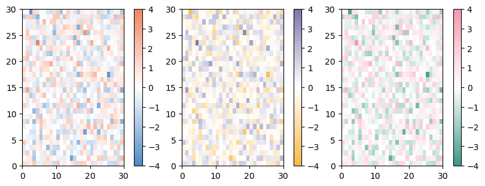

# arcadia-pycolor
Tools for using the Arcadia palette in Python.  
This package automatically generate color palettes and color maps for use with Matplotlib.

# Installation
You can install this package directly from GitHub using pip.
First, make sure you're using the right `pip` for your desired environment.  
`which pip`

Install using the pip in that environment.  
`pip install git+https://github.com/Arcadia-Science/arcadia-pycolor.git#egg=arcadia_pycolor`

## Import

Import the colors as follows.  
You can access the `'color':'HEX'` dictionaries from the below options:
- `arcadia_Core`: Core colors such as `'arcadia:forest'`
- `arcadia_Neural`: 
- `arcadia_Accent`
- `arcadia_Light_accent`
- `arcadia_Accent_expanded`
- `arcadia_Light_accent_expanded`


```python
import arcadia_pycolor as apc

display(apc.arcadia_Accent)
```


    {'arcadia:aegean': '#5088C5',
     'arcadia:amber': '#F28360',
     'arcadia:seaweed': '#3B9886',
     'arcadia:canary': '#F7B846',
     'arcadia:aster': '#7A77AB',
     'arcadia:rose': '#F898AE'}


## Matplotlib Named Colors
Arcadia colors are automatically added to the named colors list in Matplotlib.  
You can access them using a string such as `'arcadia:seaweed'`.


```python
import matplotlib.pyplot as plt
import numpy as np

colors = ['arcadia:seaweed', 'arcadia:amber']

plt.figure(figsize = (3, 2))

for color in colors:
    x, y = np.arange(5), np.random.rand(5)
    plt.plot(x, y, color = color, label = color)
    
plt.legend(loc = 'upper right', bbox_to_anchor = (1.8, 1))
plt.show()
```


    

    


## Matplotlib Named `LinearSegmentedColorMap`s

All Arcadia colors can be loaded as `LinearSegmentedColorMap` objects in a gradient starting or ending with white (`#FFFFFF`).  
These colors are added to the `mpl.colormaps` dictionary and can be accessed as follows:

- `'arcadia:color'` + `'s'` (e.g. `'arcadia:asters'`): starts with white and goes to color
- `'arcadia:color'` + `'s_r'` (e.g. `'arcadia:asters_r'`): starts with color and goes to white


```python
import matplotlib as mpl

display(mpl.colormaps['arcadia:asters'])
display(mpl.colormaps['arcadia:asters_r'])
```


<div style="vertical-align: middle;"><strong>arcadia:asters</strong> </div><div class="cmap"></div><div style="vertical-align: middle; max-width: 514px; display: flex; justify-content: space-between;"><div style="float: left;"><div title="#ffffffff" style="display: inline-block; width: 1em; height: 1em; margin: 0; vertical-align: middle; border: 1px solid #555; background-color: #ffffffff;"></div> under</div><div style="margin: 0 auto; display: inline-block;">bad <div title="#00000000" style="display: inline-block; width: 1em; height: 1em; margin: 0; vertical-align: middle; border: 1px solid #555; background-color: #00000000;"></div></div><div style="float: right;">over <div title="#7a77abff" style="display: inline-block; width: 1em; height: 1em; margin: 0; vertical-align: middle; border: 1px solid #555; background-color: #7a77abff;"></div></div>


<div style="vertical-align: middle;"><strong>arcadia:asters_r</strong> </div><div class="cmap"></div><div style="vertical-align: middle; max-width: 514px; display: flex; justify-content: space-between;"><div style="float: left;"><div title="#7a77abff" style="display: inline-block; width: 1em; height: 1em; margin: 0; vertical-align: middle; border: 1px solid #555; background-color: #7a77abff;"></div> under</div><div style="margin: 0 auto; display: inline-block;">bad <div title="#00000000" style="display: inline-block; width: 1em; height: 1em; margin: 0; vertical-align: middle; border: 1px solid #555; background-color: #00000000;"></div></div><div style="float: right;">over <div title="#ffffffff" style="display: inline-block; width: 1em; height: 1em; margin: 0; vertical-align: middle; border: 1px solid #555; background-color: #ffffffff;"></div></div>


## Matplotlib Bicolor `LinearSegmentedColorMap`s

Three pairs of colors are automatically loaded as opposing `LinearSegmentedColorMap` objects:
- `arcadia:amber` and `arcadia:aegean` ==> `arcadia:aegeanamber` or `arcadia:aegeanamber_r`
- `arcadia:canary` and `arcadia:aster` ==> `arcadia:astercanary` or `arcadia:astercanary_r`
- `arcadia:rose` and `arcadia:seaweed` ==> `arcadia:seaweedrose` or `arcadia:seaweedrose_r`

These color pairs are good for showing over/under plots such as heatmaps, and are colorblind-friendly for protanopia, deuteranopia, and tritanopia.


```python
display(mpl.colormaps['arcadia:aegeanamber'])
display(mpl.colormaps['arcadia:astercanary_r'])
display(mpl.colormaps['arcadia:seaweedrose'])

apc.plot_examples([mpl.colormaps['arcadia:aegeanamber'], 
                   mpl.colormaps['arcadia:astercanary_r'], 
                   mpl.colormaps['arcadia:seaweedrose']])
```


<div style="vertical-align: middle;"><strong>arcadia:aegeanamber</strong> </div><div class="cmap"></div><div style="vertical-align: middle; max-width: 514px; display: flex; justify-content: space-between;"><div style="float: left;"><div title="#5088c5ff" style="display: inline-block; width: 1em; height: 1em; margin: 0; vertical-align: middle; border: 1px solid #555; background-color: #5088c5ff;"></div> under</div><div style="margin: 0 auto; display: inline-block;">bad <div title="#00000000" style="display: inline-block; width: 1em; height: 1em; margin: 0; vertical-align: middle; border: 1px solid #555; background-color: #00000000;"></div></div><div style="float: right;">over <div title="#f28360ff" style="display: inline-block; width: 1em; height: 1em; margin: 0; vertical-align: middle; border: 1px solid #555; background-color: #f28360ff;"></div></div>


<div style="vertical-align: middle;"><strong>arcadia:astercanary_r</strong> </div><div class="cmap"></div><div style="vertical-align: middle; max-width: 514px; display: flex; justify-content: space-between;"><div style="float: left;"><div title="#f7b846ff" style="display: inline-block; width: 1em; height: 1em; margin: 0; vertical-align: middle; border: 1px solid #555; background-color: #f7b846ff;"></div> under</div><div style="margin: 0 auto; display: inline-block;">bad <div title="#00000000" style="display: inline-block; width: 1em; height: 1em; margin: 0; vertical-align: middle; border: 1px solid #555; background-color: #00000000;"></div></div><div style="float: right;">over <div title="#7a77abff" style="display: inline-block; width: 1em; height: 1em; margin: 0; vertical-align: middle; border: 1px solid #555; background-color: #7a77abff;"></div></div>


<div style="vertical-align: middle;"><strong>arcadia:seaweedrose</strong> </div><div class="cmap"></div><div style="vertical-align: middle; max-width: 514px; display: flex; justify-content: space-between;"><div style="float: left;"><div title="#3b9886ff" style="display: inline-block; width: 1em; height: 1em; margin: 0; vertical-align: middle; border: 1px solid #555; background-color: #3b9886ff;"></div> under</div><div style="margin: 0 auto; display: inline-block;">bad <div title="#00000000" style="display: inline-block; width: 1em; height: 1em; margin: 0; vertical-align: middle; border: 1px solid #555; background-color: #00000000;"></div></div><div style="float: right;">over <div title="#f898aeff" style="display: inline-block; width: 1em; height: 1em; margin: 0; vertical-align: middle; border: 1px solid #555; background-color: #f898aeff;"></div></div>


    

    


```python

```
