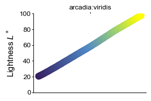
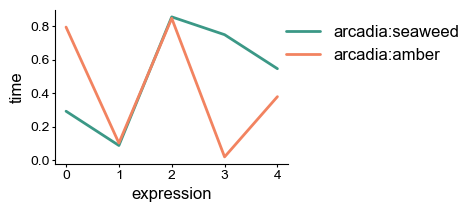
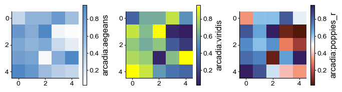
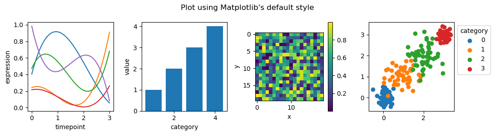
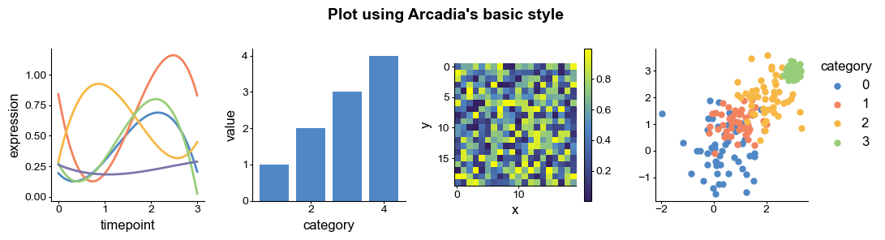
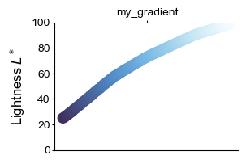
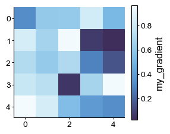

# arcadia-pycolor
Tools for using the Arcadia palette in Python.  
This package automatically generate color palettes and color maps for use with Matplotlib.

---

## 0. Setup
You can install this package directly from GitHub using pip.
First, make sure you're using the right `pip` for your desired environment.  
`which pip`

Install using the pip in that environment.  
`pip install git+https://github.com/Arcadia-Science/arcadia-pycolor.git#egg=arcadia_pycolor`

### Import

Import the package as usual.  
You might want to abbreviate it to `apc` as below. 


```python
import arcadia_pycolor as apc
```

---
## 1. Basic Color Access

Each named color is stored as a `dict`, accessible as its own variable.  
This enables quick lookup of a color of interest.

You can also generate a visual display of a color using the `print_color()` method.


```python
apc.aegean
```


    {'arcadia:aegean': '#5088C5'}


```python
apc.print_color(apc.aegean)
```


<span style="font-family: monospace"> #5088C5 <span style="color: #5088C5">██████</span> arcadia:aegean</span>


### Palette Dictionaries

The base color palettes (`arcadia_Core`, `arcadia_Neutral`, `arcadia_Accent`, etc.) are also stored as dictionaries.


```python
apc.arcadia_Accent
```


    {'arcadia:aegean': '#5088C5',
     'arcadia:amber': '#F28360',
     'arcadia:seaweed': '#3B9886',
     'arcadia:canary': '#F7B846',
     'arcadia:aster': '#7A77AB',
     'arcadia:rose': '#F898AE'}


```python
apc.print_color(apc.arcadia_Accent)
```


<span style="font-family: monospace"> #5088C5 <span style="color: #5088C5">██████</span> arcadia:aegean</span><br><span style="font-family: monospace"> #F28360 <span style="color: #F28360">██████</span> arcadia:amber</span><br><span style="font-family: monospace"> #3B9886 <span style="color: #3B9886">██████</span> arcadia:seaweed</span><br><span style="font-family: monospace"> #F7B846 <span style="color: #F7B846">██████</span> arcadia:canary</span><br><span style="font-family: monospace"> #7A77AB <span style="color: #7A77AB">██████</span> arcadia:aster</span><br><span style="font-family: monospace"> #F898AE <span style="color: #F898AE">██████</span> arcadia:rose</span>


---
## 2. The `Palette` class

In addition to basic dictionaries that store colors, `arcadia_pycolor` includes some custom Python classes that make it easier to use different palettes in different contexts.  
Each of the core color palettes is stored as a `Palette` object, which has a variety of methods that allow you visualize the included colors.  

For example, the `.display()` method prints the color palette as an image.


```python
apc.Palettes['arcadia:Core'].display()
apc.Palettes['arcadia:Neutral'].display()
apc.Palettes['arcadia:AccentFull'].display()
apc.Palettes['arcadia:LightFull'].display()
```

    /Users/dennis/Code/arcadia-pycolor/arcadia_pycolor/functions.py:138: UserWarning: Tight layout not applied. The bottom and top margins cannot be made large enough to accommodate all axes decorations.
      plt.tight_layout()


    

    


    

    


    

    


    

    


You can find a list of all the `Palette` objects in the `apc.Palettes` `dict`.


```python
apc.Palettes.keys()
```


    dict_keys(['arcadia:All', 'arcadia:Core', 'arcadia:Neutral', 'arcadia:Accent', 'arcadia:AccentExpanded', 'arcadia:AccentFull', 'arcadia:AccentOrdered', 'arcadia:Light', 'arcadia:LightExpanded', 'arcadia:LightFull', 'arcadia:LightOrdered', 'arcadia:AccentAll', 'arcadia:AccentAllOrdered', 'arcadia:Other', 'arcadia:AllOrdered'])


### Data structures

Different plotting software might expect color information in different formats, including `list`s, `dict`s, `tuple`s, etc.  
The `Palette` class allows for quick access to a variety of data structures.  


```python
# Return palette colors as a dictionary
print(apc.Palettes['arcadia:Accent'].dict)

# Return colors as a list
print(apc.Palettes['arcadia:Accent'].colors)

# Return palette colors as a list of tuples
print(apc.Palettes['arcadia:Accent'].tuple_list)
```

    {'arcadia:aegean': '#5088C5', 'arcadia:amber': '#F28360', 'arcadia:seaweed': '#3B9886', 'arcadia:canary': '#F7B846', 'arcadia:aster': '#7A77AB', 'arcadia:rose': '#F898AE'}
    ['#5088C5', '#F28360', '#3B9886', '#F7B846', '#7A77AB', '#F898AE']
    [('arcadia:aegean', '#5088C5'), ('arcadia:amber', '#F28360'), ('arcadia:seaweed', '#3B9886'), ('arcadia:canary', '#F7B846'), ('arcadia:aster', '#7A77AB'), ('arcadia:rose', '#F898AE')]


---
## 3. The `Gradient` class

In addition to individual colors, sometimes it's important to have gradients of color for plotting.  
Each Arcadia color is available as a linear gradient from `arcadia:paper` (#FAFAFA).  
You can access these in the `apc.Gradients` dictionary by appending an `s` to the end of the color name.

These gradients are stored in the `Gradient` class, which is a subclass of `Palette`.  
All methods from the `Palette` class also work on `Gradient`s, such as `.display()`.


```python
apc.Gradients['arcadia:aegeans'].display()
```


    

    


The package includes some custom color gradients that are designed to be analogous to existing color gradients like "viridis" or "magma" but are more aesthetically compatible with Arcadia's brand colors.  


```python
apc.Gradients['arcadia:viridis'].display()
apc.Gradients['arcadia:magma'].display()
apc.Gradients['arcadia:cividis'].display()
```


    

    


    

    


    

    


These gradients are composed of a dictionary of colors, just like a `Palette` class, but with an additional set of `values` from 0 to 1 for each color in the gradient.  
These `values` indicate where each color falls along the gradient.  

You can access colors and values in different data structure, just as you would for the `Palette` class.


```python
# Return gradient colors as a dictionary
print(apc.Gradients['arcadia:viridis'].dict)

# Return values of gradient colors
print(apc.Gradients['arcadia:viridis'].values)

# Return paired list of gradient colors and positions as tuples
print(apc.Gradients['arcadia:viridis'].grad_tuple_list)

# Return paired list of gradient colors and positions as lists
print(apc.Gradients['arcadia:viridis'].grad_nested_list)
```

    {'arcadia:concord': '#341E60', 'arcadia:aegean': '#5088C5', 'arcadia:lime': '#97CD78', 'yellow': '#FFFF00'}
    [0, 0.49, 0.75, 1]
    [(0, '#341E60'), (0.49, '#5088C5'), (0.75, '#97CD78'), (1, '#FFFF00')]
    [[0, '#341E60'], [0.49, '#5088C5'], [0.75, '#97CD78'], [1, '#FFFF00']]


### Gradient visualization

You can also use built-in methods of the `Gradient` class to see the gradient in grayscale and see how uniformly its lightness scales.


```python
apc.Gradients['arcadia:viridis'].plot_gradient()
apc.Gradients['arcadia:viridis'].plot_lightness()
```


    

    


    

    


### Bicolor gradients

In addition to linear gradients, the package also contains six built-in bicolor gradients.  
These color gradients have been chosen to have linearly-increasing lightness and to be colorblind-friendly.  


```python
apc.Gradients['arcadia:aegeanamber'].display(11)
apc.Gradients['arcadia:astercanary'].display(11)
apc.Gradients['arcadia:seaweedrose'].display(11)

apc.Gradients['arcadia:poppies'].display(11)
apc.Gradients['arcadia:pansies'].display(11)
apc.Gradients['arcadia:dahlias'].display(11)
```


    

    


    

    


    

    


    

    


    

    


    

    


## Reverse gradients

All gradients in the package are also available in a reversed order.  
These can be accessed from the `apc.Gradients` dictionary by adding `'_r'` to the end of the gradient name.  


```python
apc.Gradients['arcadia:aegeans'].display()
apc.Gradients['arcadia:aegeans_r'].display()
```


    

    


    

    


---
## 5. `matplotlib` features

The `arcadia_pycolor` automatically integrates with `matplotlib`.  
It registers Arcadia colors, palettes, and gradients as `matplotlib` named colors.


```python
import matplotlib.pyplot as plt
import numpy as np

colors = ['arcadia:seaweed', 'arcadia:amber']

plt.figure(figsize = (3, 2))

for color in colors:
    x, y = np.arange(5), np.random.rand(5)
    plt.plot(x, y, color = color, label = color)

plt.ylabel('time')
plt.xlabel('expression')

plt.legend(loc = 'upper right', bbox_to_anchor = (1.8, 1))
plt.show()
```


    

    


All `Palette` and `Gradient` colors are automatically registered as `matplotlib` named entries.


```python
prng = np.random.RandomState(20230710)
random_sample_1 = prng.random_sample(size = (5, 5))

fig, axs = plt.subplots(1, 3, figsize = (7, 2))

cmaps = ['arcadia:aegeans', 'arcadia:viridis', 'arcadia:poppies_r']

for cmap, ax in zip(cmaps, axs):
    im = ax.imshow(random_sample_1, cmap = cmap)
    plt.colorbar(im, label = cmap)

plt.tight_layout()
plt.show()
```


    

    


### Default plotting style

Importing `arcadia_pycolor` updates the Matplotlib stylesheet settings so that the defaults better conform with Arcadia's figure styles.  
You can use Arcadia's default style without having to manually set it for every plot.  

Things that are modified by using `arcadia_pycolor` with `matplotlib`:
- the default color cycler is changed to match `arcadia:AccentAllOrdered`
- the default gradient is set to `arcadia:viridis`
- the default font is changed to `Arial`
- plots saved as `.svg` or `.pdf` format automatically have editable instead of rasterized text


```python
from scipy.interpolate import make_interp_spline

nlines = 5
timepoints = 4

X_ = []
Y_ = []

prng = np.random.RandomState(20230710)
random_sample = prng.random_sample(size = (20, 20))

for i in np.arange(nlines):
    x = np.arange(timepoints)
    y = np.random.rand(timepoints)

    spline = make_interp_spline(x, y)

    X_.append(np.linspace(x.min(), x.max(), 500))
    Y_.append(spline(X_)[0])
    

xs = []
ys = []
points = 50
for i in np.arange(timepoints):
    xi, yi = prng.normal(loc = x[i], scale = np.random.rand(), size = (2, points))
    xs.append(xi)
    ys.append(yi)

def plot_style_examples(title = ''):
    fig, axs = plt.subplots(1, 4, figsize = (11, 3))
    
    for i in np.arange(nlines):
        axs[0].plot(X_[i], Y_[i])
    axs[0].set_xlabel('timepoint')
    axs[0].set_ylabel('expression')
    
    axs[1].bar([1, 2, 3, 4], [1, 2, 3, 4])
    axs[1].set_xlabel('category')
    axs[1].set_ylabel('value')
    
    im = axs[2].imshow(random_sample)
    axs[2].set_xlabel('x')
    axs[2].set_ylabel('y')
    
    for i in np.arange(timepoints):
        axs[3].scatter(xs[i], ys[i], label = i)
    axs[3].legend(loc = 'best', bbox_to_anchor = (1, 1), title = 'category')
    
    plt.suptitle(title)
    plt.colorbar(im)
    
    plt.tight_layout()

    plt.show()

# Plot examples using Matplotlib's default styling
with plt.style.context("default"):
    plot_style_examples("Plot using Matplotlib's default style")

# Plot examples using Arcadia's basic style (set as default by importing arcadia_pycolor)
plot_style_examples("Plot using Arcadia's basic style")
```


    

    


    

    


---
## 6. Customization

The classes and methods of the package can be used to build and test your own color palettes and gradients.  


```python
# construct a gradient using built-in colors and custom values
my_gradient_dict = {
    'color_dict': apc.royal | apc.aegean | apc.vitalblue | apc.bluesky | apc.zephyr | apc.paper,
    'values': [0, 0.3, 0.5, 0.8, 0.95, 1]
}

# instantiate a new Gradient object
my_gradient = apc.Gradient(
    name = 'my_gradient',
    color_dict = my_gradient_dict['color_dict'], 
    values = my_gradient_dict['values']
)

# use built-in methods to plot the gradient
my_gradient.display()
my_gradient.plot_gradient()
my_gradient.plot_lightness()

# register the gradient with Matplotlib
my_gradient.mpl_LinearSegmentedColormap_register()

# use custom colormap by name in Matplotlib
plt.figure(figsize = (3, 2.5))
im = plt.imshow(random_sample_1, cmap = 'my_gradient')
plt.colorbar(im, label = 'my_gradient')
plt.show()
```

    /Users/dennis/Code/arcadia-pycolor/arcadia_pycolor/functions.py:138: UserWarning: Tight layout not applied. The bottom and top margins cannot be made large enough to accommodate all axes decorations.
      plt.tight_layout()


    

    


    

    


    

    


    

    


---
### Note
This README file is converted to markdown using:

`jupyter nbconvert --execute --to markdown README.ipynb`
