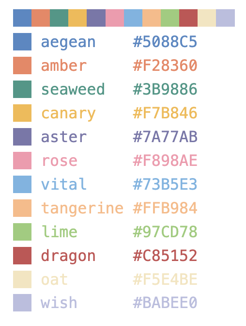
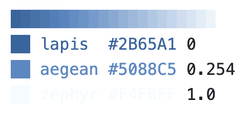

# Quickstart guide

This notebook provides a quick introduction to the `arcadia_pycolor` Python package and how to use it to style Matplotlib and seaborn plots so that they comply with the Arcadia style guide.

For detailed documentation about the package and links to example plots, please see [the documentation README](/docs/README.md).

For links to the Arcadia style guide, please refer to [the "brand assets" page](https://www.notion.so/arcadiascience/Brand-assets-ec521e5b599c4a5f88c5fae3a8ac14b7) on Notion.

## Install the `arcadia_pycolor` package

The `arcadia_pycolor` package can be installed using pip. In a virtual environment of your choice, run the following command in your terminal:

```bash
pip install arcadia-pycolor
```

The package can then be imported in notebooks or scripts using the following command:

```python
import arcadia_pycolor as apc
```

Note: the package should be compatible with most existing Python environments. It requires Python version 3.9 or higher and has only two direct dependencies (`matplotlib` and `colorspacious`).

## Set the default Matplotlib styles

The package provides a function called `apc.mpl.setup` that sets the default Matplotlib styles to match the Arcadia style guide. This function only needs to be called once, ideally at the beginning of the notebook or script. The styles it sets will automatically apply to all plots in the notebook or script.

```python
import matplotlib.pyplot as plt
import seaborn as sns
import arcadia_pycolor as apc

# Call the `setup` function once, at the beginning of a notebook or script.
apc.mpl.setup()

# Matplotlib plots will now use the Arcadia style guide.
plt.plot([3, 1, 4, 1, 5])
plt.show()

# Seaborn plots will also use the Arcadia style guide.
sns.histplot([3, 1, 4, 1, 5])
plt.show()
```

### What does `apc.mpl.setup` do?

The `apc.mpl.setup` does several different things:

- It loads the Arcadia fonts.
- It registers Arcadia color palettes and gradients with Matplotlib (see the section ["Using Arcadia colors"](#using-arcadia-colors) below).
- It sets the default Matplotlib styles to match the Arcadia style guide.

**To see before-and-after examples of what `apc.mpl.setup` does, please refer to [the documentation about styling plots](/docs/style_usage.ipynb).**

### A note about the Arcadia fonts

The Arcadia style guide uses the Suisse family of fonts. When `apc.mpl.setup` is called, it automatically configures Matplotlib to use these fonts. If they are not installed, Matplotlib will use its default fonts instead.

The Suisse fonts are proprietary. To install them, please refer to [the "brand assets" page](https://www.notion.so/arcadiascience/Brand-assets-ec521e5b599c4a5f88c5fae3a8ac14b7#d1cbc8fc315b4d10a8fd4cc7d9eb8c3f) on Notion for instructions. Please do not share these fonts outside of Arcadia.

## Styling individual plots

Some aspects of the style guide can only be applied to individual plots. The `apc.mpl.style_plot` function can be used to apply these styles to a single plot. This function takes a Matplotlib `Axes` object as input.

```python
import matplotlib.pyplot as plt
import arcadia_pycolor as apc

apc.mpl.setup()

plt.plot([3, 1, 4, 1, 5])
apc.mpl.style_plot()
plt.show()
```

If an `Axes` object is not passed to `style_plot`, the function will style the current plot (internally, `style_plot` uses `plt.gca()` to get the "current" `Axes` object).

By default, the `style_plot` function capitalizes the x- and y-axis labels and styles the legend, if one exists. In addition, it has a few optional arguments that can be used to customize the styling of the x- and y-axis tick labels:

- `monospaced_axes` sets the tick labels of the x- and/or y-axis to a monospaced font.
- `categorical_axes` adjusts the x- and/or y-axis styles to be more readable when the axis represents a categorical variable.
- `colorbar_exists` tells the function to style the colorbar, if one exists.

**To see examples of what the `style_plot` function does, please see [the documentation about styling plots](/docs/style_usage.ipynb).**

## Using Arcadia colors

The Arcadia style guide defines sets of colors called "color palettes" that should be used in all figures. The `arcadia_pycolor` package provides easy access to both individual colors and to pre-defined palettes and gradients.

### Using individual colors

All of the individual named colors listed in the style guide are available as attributes of the main `apc` module. For example, to create two line plots using the colors "aegean" and "rose":

```python
import matplotlib.pyplot as plt
import arcadia_pycolor as apc

plt.plot([1, 2, 3], [4, 5, 6], color=apc.aegean)
plt.plot([1, 2, 3], [8, 10, 12], color=apc.rose)
```

To visualize a particular color, simply type it in a Jupyter notebook cell:

```python
apc.aegean
```

When the cell is evaluated, it will output the name and hex code of the color alongside a swatch showing what the color looks like:


### Using color palettes

Individual colors are organized into groups called "palettes." The palettes themselves have names and are accessible as attributes of the `apc.palettes` module. For example, we can rewrite the previous example to use the first two colors in the "primary" palette:

```python
plt.plot([1, 2, 3], [4, 5, 6], color=apc.palettes.primary.colors[0])
plt.plot([1, 2, 3], [4, 6, 8], color=apc.palettes.primary.colors[1])
```

To see all of the colors in a palette, evaluate the palette object in a notebook cell:

```python
apc.palettes.primary
```

This outputs a list of color swatches with the names and hex codes of the colors in the palette:



### Using color gradients

The Arcadia style guide also defines continuous color gradients that can be used in plots like heatmaps. These gradients are accessible as attributes of the `apc.gradients` module. To use a gradient in a Matplotlib or seaborn plot, you can convert it to a Matplotlib colormap using the `to_mpl_cmap` method. For example, to use the "blues" gradient in a heatmap:

```python
import matplotlib.pyplot as plt
import numpy as np
import seaborn as sns

import arcadia_pycolor as apc

data = np.random.rand(10, 10)
sns.heatmap(data, cmap=apc.gradients.blues.to_mpl_cmap())
```

Just like palettes, gradients can be visualized by evaluating a gradient object in a Jupyter notebook cell:

```python
apc.gradients.blues
```

This outputs a gradient swatch showing the colors in the gradient:



### Referring to color palettes and gradients by name

After `apc.mpl.setup` is called (see above), it registers all of the built-in color palettes and gradients with Matplotlib. This means that you can refer to them by name in any Matplotlib or seaborn plot. For example, to use the "blues" gradient in a heatmap without having to type `apc.gradients.blues` or convert it to a Matplotlib colormap, use the string `"apc:blues"` as the `cmap` argument:

```python
import matplotlib.pyplot as plt
import numpy as np
import seaborn as sns

import arcadia_pycolor as apc

data = np.random.rand(10, 10)
sns.heatmap(data, cmap="apc:blues")
```

**For much more detail about how to use color palettes and gradients in your figures, please refer to [the documentation about using colors](/docs/color_usage.ipynb).**
